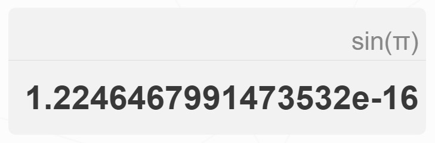
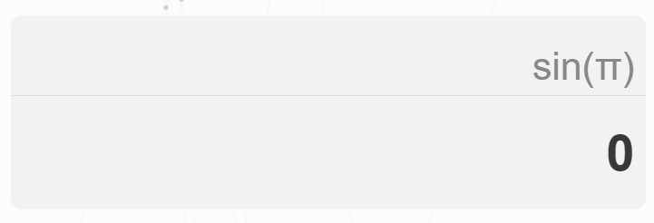
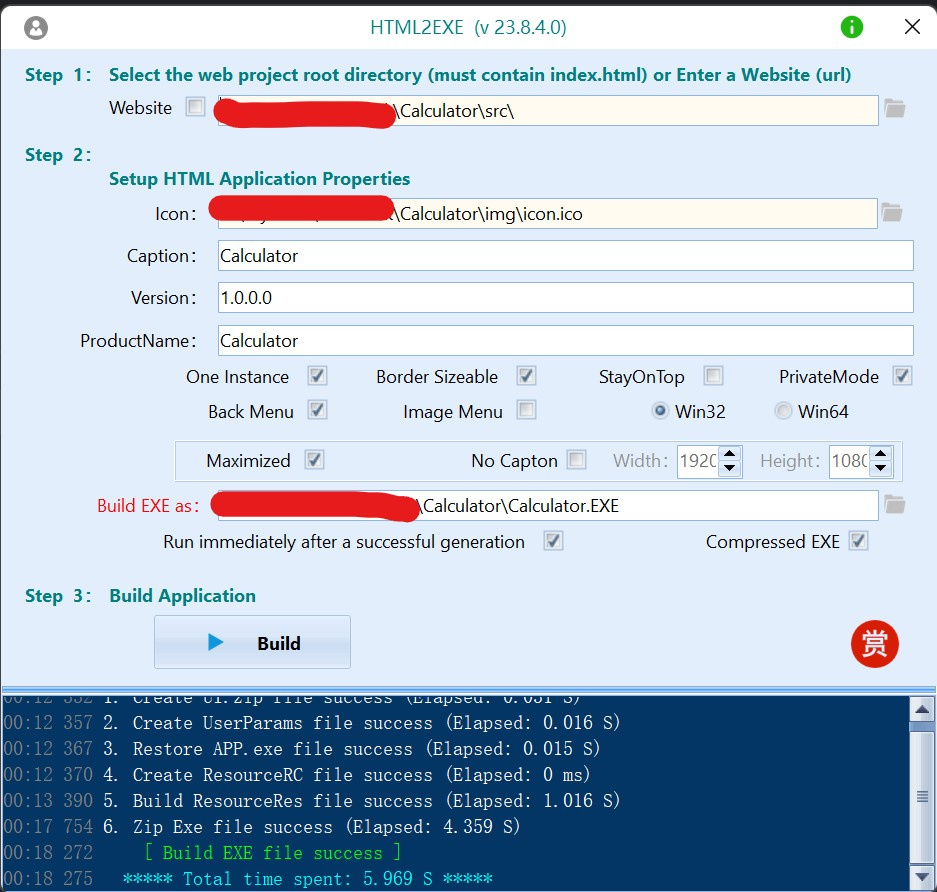
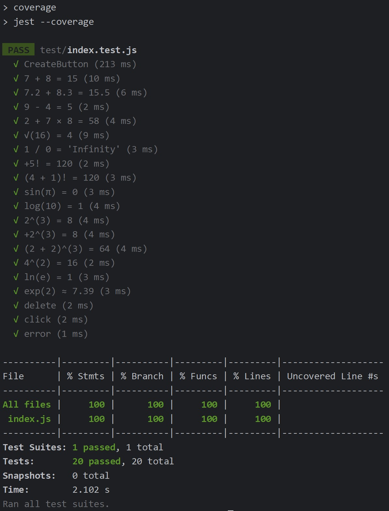

# Calculator

任务：完成一个具有可视化界面的计算器

[源代码链接](https://github.com/DreamBinary/SoftWork/tree/master/Calculator)

0. **界面展示**


1. **PSP表格**

   | PSP                                     | Personal Software Process Stages        | 预估耗时（分钟） | 实际耗时（分钟） |
   | :-------------------------------------- | :-------------------------------------- | :--------------- | :--------------- |
   | Planning                                | 计划                                    | 60               | 40               |
   | • Estimate                              | • 估计这个任务需要多少时间              | 15               | 10               |
   | Development                             | 开发                                    | 700              | 850              |
   | • Analysis                              | • 需求分析 (包括学习新技术）            | 100              | 150              |
   | • Design Spec                           | • 生成设计文档                          | 60               | 75               |
   | • Design Review                         | • 设计复审                              | 30               | 45               |
   | • Coding Standard                       | • 代码规范 (为目前的开发制定合适的规范) | 30               | 40               |
   | • Design                                | • 具体设计                              | 60               | 90               |
   | • Coding                                | • 具体编码                              | 300              | 350              |
   | • Code Review                           | • 代码复审                              | 45               | 60               |
   | • Test                                  | • 测试（自我测试，修改代码，提交修改）  | 60               | 75               |
   | Reporting                               | 报告                                    | 90               | 60               |
   | • Test Repor                            | • 测试报告                              | 30               | 20               |
   | • Size Measurement                      | • 计算工作量                            | 15               | 10               |
   | • Postmortem & Process Improvement Plan | • 事后总结, 并提出过程改进计划          | 45               | 30               |
   |                                         | 合计                                    | 850              | 950              |

2. **解题思路描述**

   要求实现一个具有图形化界面简易计算器

   1. 编程语言选择。原本打算使用 Java，Python 等的 GUI 框架来实现一个简单图形化界面，但是界面要实现的好看比较困难，最后选择 html + css + js 来实现。
   2. 界面设计。一般的计算器都比较简陋，要做一个比较好看的计算器需要花点时间来设计 UI 界面，以前有开发移动端的经验，看过比较多的 UI 设计，这点比较容易。
   3. 核心功能。实现计算功能用 js 其实就是字符串的计算，计算逻辑的实现是比较困难的，特别是加上了科学计算以后。这点可以去 github 和 stackflow 上看看。
   4. exe打包。作业要求要生成 exe 文件，第一次遇到 html 生成 exe 的情况。查找到软件  [HTML2EXE](http://szhnnas.abitsoft.com:8081/) 可以实现此需求（超好用）。

3. **设计与实现过程**

   项目由 html、css、js 完成。

   1. 将所有的按键及属性装在一个数组内，便于后续代码的编写

      ```js
      let calculator_buttons = [
          {
              name: "square-root", symbol: "√", formula: "Math.sqrt(", type: "math_function"
          }, {
              name: "square", symbol: "x²", formula: POWER, type: "math_function"
          }
          .....
          ];
      ```

   2. 将输入的字符分为 operation (显示的字符串) 和 formula (计算使用的字符串)

      ```js
      let data = {
          operation: [], formula: [],
      }
      ```

   3. 点击等于的时候进行计算

      ```js
      function calculator(button) {
          if (button.type === 'operator') {
              data.operation.push(button.symbol)
              data.formula.push(button.formula)
          }
          	......
          else if (button.type === 'math_function') {
              let symbol, formula;
              if (button.name === 'factorial') {
                  symbol = "!"
                  formula = button.formula
                  data.operation.push(symbol)
                  data.formula.push(formula)
              } 
              ......
          } else if (button.type === 'key') {
              if (button.name === 'clear') {
                  data.operation = []
                  data.formula = []
                  updateOutputResult(0)
              } 
              ......
          } else if (button.type === 'calculate') {
              formula_str = data.formula.join('')
              // 生成计算使用的字符串
              ......
              let result
              try {
                  // 计算结果
                  ......
              } catch (error) {
                  if (error instanceof SyntaxError) {
                      result = "SyntaxError"
                      updateOutputResult(result)
                      return
                  }
              }
              ans = result  // 保存上一次计算结果
              data.operation = [result]
              data.formula = [result]
              updateOutputResult(result)
              return
          }
          updateOutputOperation(data.operation.join(''))
      }
      ```

   4. 将 formula 生成计算使用的字符串

      ```js
      let POWER_SEARCH_RESULT = search(data.formula, POWER)
              let FACTORIAL_SEARCH_RESULT = search(data.formula, FACTORIAL)
              const BASES = powerBaseGetter(data.formula, POWER_SEARCH_RESULT)
              BASES.forEach(base => {
                  let toreplace = base + POWER
                  let replacement = "Math.pow(" + base + ",";
                  formula_str = formula_str.replace(toreplace, replacement)
              })
              const NUMBERS = factorialNumGetter(data.formula, FACTORIAL_SEARCH_RESULT)
              NUMBERS.forEach(number => {
                  formula_str = formula_str.replace(number.toReplace, number.replacement)
              })
      ```

      

   5. 由于 js 的 eval 产生的结果会有多数的小数，这里进行优化，对小数取两位小数，对整数则正常输入

      ```js
      const r = /^\+?[1-9][0-9]*$/;
                  result = eval(formula_str);
                  if (!r.test(result)) {
                      result = parseFloat(result.toFixed(2));
                  }
      ```

      

      6. html 生成 exe
      
         
      
        

4. **程序性能改进**

   1. 字符串处理改进

      在刚开始，对输入的数字或者运算符进行简单的拼接字符串仅仅可以实现简单的加减乘除，难以实现三角函数等科学运算。改进之后，将显示和计算的字符串分开存储，这样便于计算操作。

   2. 减少DOM操作

      尽量减少对DOM的频繁操作，将多个DOM操作合并成一个，使用DocumentFragment来减少DOM重绘。

5. **单元测试展示**

   1. 本项目采用 jest 进行单元测试，这个测试框架用起来十分便利

      ```json
      {
        "devDependencies": {
          "jest": "^29.7.0",
          "jsdom": "^22.1.0"
        },
        "scripts": {
          "test": "jest",
          "coverage": "jest --coverage"
        }
      }
      
      ```

   2. 测试代码

      ```js
      test("7 + 8 = 15", () => {
          calculator(calculator_buttons[4]) // clear
          calculator(calculator_buttons[10])  // 7
          calculator(calculator_buttons[36]) // +
          calculator(calculator_buttons[11])  // 8
          expect(document.querySelector('.operation .value').innerHTML).toBe("7+8")
          calculator(calculator_buttons[35]) // equal
          expect(document.querySelector('.result .value').innerHTML).toBe("15")
      })
      test("√(16) = 4", () => { ...... }
      test("(2 + 2)^(3) = 64", () => { ...... }
      test("exp(2) ≈ 7.39", () => { ...... }
      test("+2^(3) = 8", () => { ...... }
      ```

   3. 构造数据及优化覆盖率

      构造测试数据主要是计算器的运算符都要用上，另外要注意一下比较少见的数据，比如 "+2^(3) = 8"。比较偏的地方注意到了，覆盖率就上去了

   4. 覆盖率结果

   

6. **心路历程与收获**。

   ​	项目的初衷是创建一个科学计算器的Web应用，使用户能够执行基本的数学运算，如加减乘除，以及更高级的科学计算。在实现过程中我意识到用户界面对于计算器的吸引力和可用性至关重要，因此，我花了一些时间完成了一个直观且美观的UI。

   ​	通过这个项目，我学到了很多关于前端开发的知识和技巧，提高了HTML、CSS和JavaScript编程的能力，学会了如何创建具有可视化界面的Web应用。此外，我还学会了如何设计用户友好的界面，并如何进行测试和调试以确保应用的质量。

   